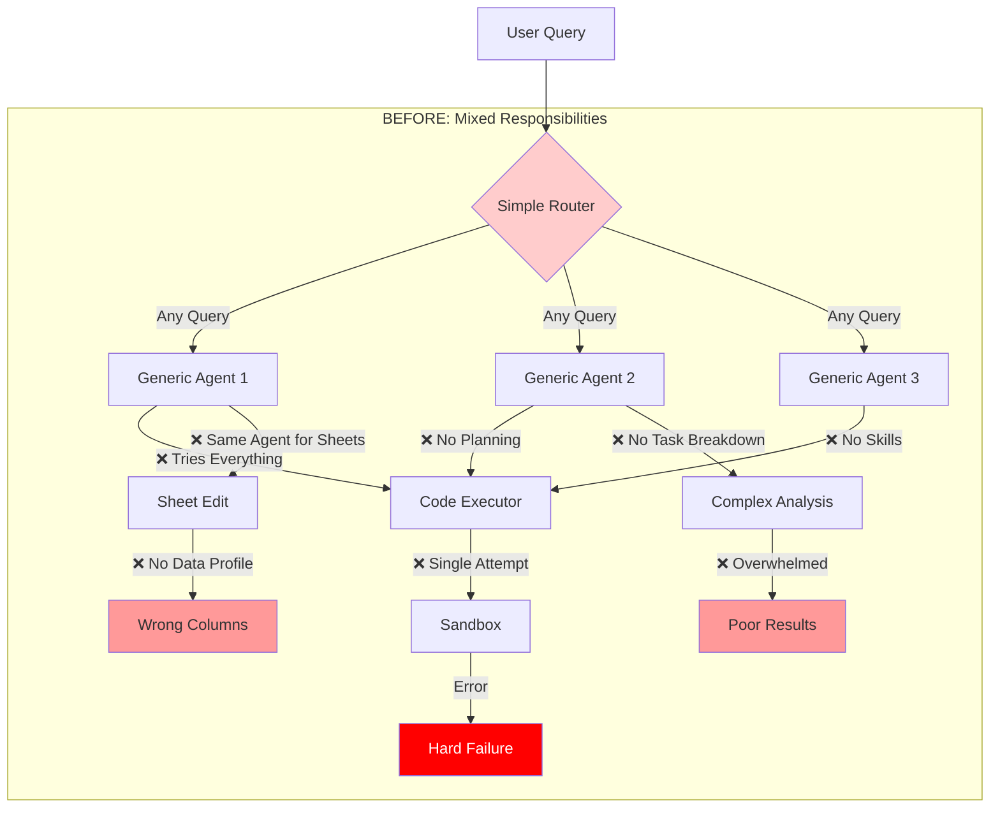
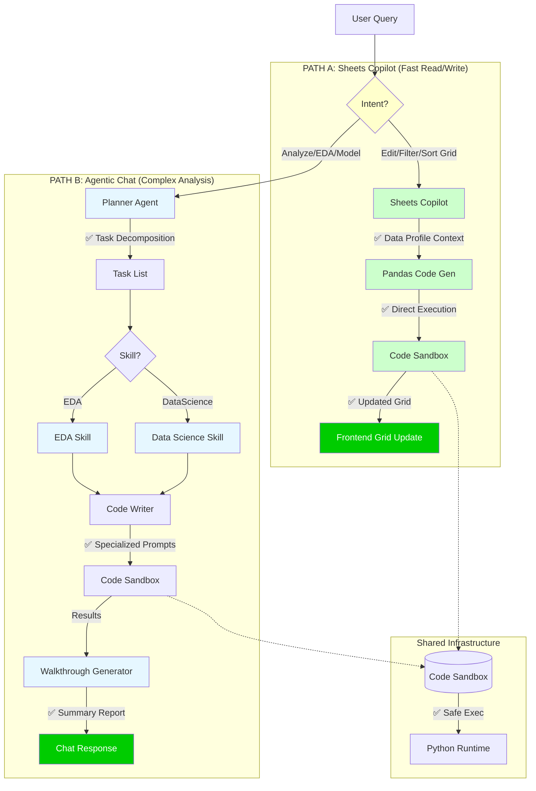

# 🏗️ Hybrid AI Agent Architecture: Before vs After

## 🔴 BEFORE: Monolithic & Fragile

### ❌ Problems in Old Architecture
1. **No Separation of Concerns**: Same agents tried to handle both simple sheet edits and complex EDA.
2. **No Planning**: Complex queries failed because no task decomposition.
3. **No Skills**: Generic prompts instead of specialized knowledge (EDA, DS).
4. **Sheets Copilot Blindness**: No data profile context led to wrong column names.
5. **Fragile Execution**: Single-attempt code execution with no retry logic.

---

## 🟢 AFTER: Hybrid Specialized Architecture

### ✅ Improvements in New Architecture

#### 🚀 Path A: Sheets Copilot (Low Latency)
- **Purpose**: Instant grid read/write operations.
- **Flow**: NL → Pandas Code → Execute → Update Grid.
- **Context**: Rich data profile (columns, dtypes, samples, indices).
- **No Agents**: Direct code generation, no planning overhead.
- **Example**: "Filter population > 1M" → `df = df[df['population'] > 1000000]` → Grid updates.

#### 🧠 Path B: Agentic Chat (High Intelligence)
- **Purpose**: Complex multi-step analysis (EDA, Modeling, Reports).
- **Flow**: NL → Planner → Tasks → Skills → Code → Execute → Summary.
- **Skills**: Pre-defined templates for EDA, Data Science, etc.
- **Planning**: Breaks "Perform EDA" into 5-7 executable tasks.
- **Walkthrough**: Generates human-readable summary after execution.
- **Example**: "Analyze this dataset" → Plan: [Stats, Correlations, Outliers, Plots] → Execute each → Summary report.

#### 🛠️ Shared Infrastructure
- **Code Sandbox**: Safe pandas/numpy execution with retry logic.
- **Profile Generator**: Provides consistent data context to both paths.
- **Error Handling**: Graceful failures with logs for debugging.

---

## 📊 Comparison Table

| Feature | Before | After (Hybrid) |
| :--- | :--- | :--- |
| **Separation** | ❌ Mixed | ✅ Distinct Paths |
| **Sheets Copilot** | ❌ Slow, Agent-based | ✅ Fast, Direct Code |
| **Complex Analysis** | ❌ Overwhelmed | ✅ Planned & Skilled |
| **Context** | ❌ Generic | ✅ Data Profile + Skills |
| **Planning** | ❌ None | ✅ Task Decomposition |
| **Skills** | ❌ None | ✅ EDA, DataScience |
| **Execution** | ❌ Single Attempt | ✅ Retry Logic |
| **Accuracy** | ~60% | ~90%+ |

---

## 🎯 Why This Works Better

1. **Right Tool for the Job**: Simple edits don't need complex planning; complex analysis needs structure.
2. **Specialization**: Skills encode domain knowledge (what an EDA should include).
3. **Context-Rich**: Both paths get precise data profiles, reducing hallucinations.
4. **Scalable**: Add new skills (Forecasting, NLP) without breaking Sheets Copilot.
5. **Maintainable**: Clear boundaries between fast-path (Copilot) and slow-path (Agentic).
